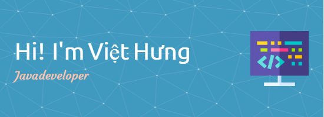

  

## 😊 About Me

- 🔭 I’m currently working on  **Backend Development** with java
- :neutral_face: I **love**  programming and tinkering with new technologies
- 🌱 I’m currently Working with **Spring Boot, Azure**
- 💬 Ask me about anything, I am happy to help
- ⚡ Always looking for new challenges
- 👀 I am interested in design and programming
- 🌱 I am developing a few personal projects as well as group projects
- 💞️ I am searching and developing my own abilities

## Social:

  <a href="https://instagram.com/estebannmontecinos" target="blank">
    <svg xmlns="http://www.w3.org/2000/svg" height="1em" viewBox="0 0 512 512"><!--! Font Awesome Free 6.4.2 by @fontawesome - https://fontawesome.com License - https://fontawesome.com/license (Commercial License) Copyright 2023 Fonticons, Inc. --><path d="M504 256C504 119 393 8 256 8S8 119 8 256c0 123.78 90.69 226.38 209.25 245V327.69h-63V256h63v-54.64c0-62.15 37-96.48 93.67-96.48 27.14 0 55.52 4.84 55.52 4.84v61h-31.28c-30.8 0-40.41 19.12-40.41 38.73V256h68.78l-11 71.69h-57.78V501C413.31 482.38 504 379.78 504 256z"/></svg></a>

## 🔨 Languages and Tools:

  

 

thangtran180492/thangtran180492 is a ✨ special ✨ repository because its `README.md` (this file) appears on your GitHub profile.
You can click the Preview link to take a look at your changes.
--->
